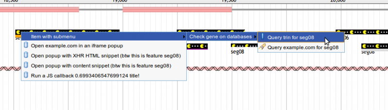
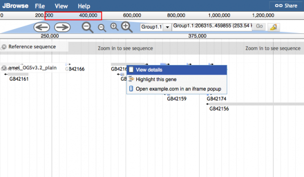
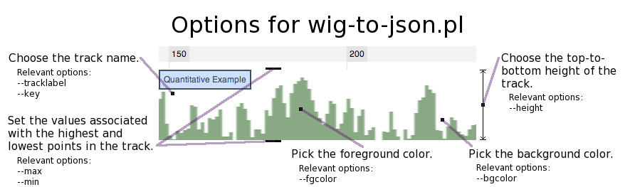
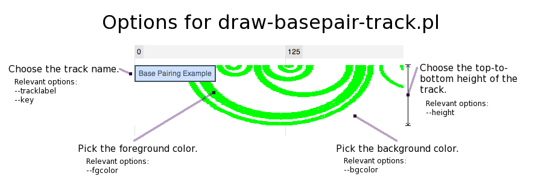

# Introduction

This page provides a comprehensive reference guide for configuring JBrowse. If you find something that is missing or inaccurate, please feel very free to edit it!

Note: this is a **reference guide**. It is not meant to be read from beginning to end. If this is your first time setting up JBrowse, you probably want to read the [Quick-start tutorial](http://jbrowse.org/code/latest-release/docs/tutorial/index.html) first, and then consult this guide when you need information on specific things you want to do with your JBrowse.

Check out the new [JBrowse FAQ](faq.html) page for more tips on setup and configuration.

Also see the [JBrowse Desktop](jbrowse_desktop.html) guide here.

# Feature Tracks (HTMLFeatures and CanvasFeatures)

Feature tracks can be used to visualize localized annotations on a sequence, such as gene models, transcript alignments, SNPs and so forth.
## Generic Track Configuration Options

|Option|Description|
|------|-----------|
|`subfeatureDetailLevel `|Set the level of detail of the View details box. If set to 1, only displays one level of subfeatures for example. Default: 0 which displays all subfeature levels. Added in 1.12.3|

## Customizing parts of the 'View details' Pop-ups with callbacks

Starting in JBrowse version 1.11.3, the ability to customize parts of the 'View details' Pop-ups was added. This lets you specify functions that have the format fmtDetailValue_\* or fmtDetailField_\* to either change the value section of an attribute in the config, or the fieldname of an attribute in the config.

Here is an example in tracks.conf format for formatting the "Name" field by adding a link to it:

```
[tracks.mygff]
key = My Gene Track
storeClass = JBrowse/Store/SeqFeature/NCList
type = FeatureTrack
fmtDetailValue_Name = function(name) {
   return "<a href='http://www.example.com?featurename="+name+"'>"+name+"</a>";
 }
```
Note: It is also easy to specify these methods in trackList.json format.
```
{
 "key": "My Gene Track",
 "storeClass" : "JBrowse/Store/SeqFeature/NCList",
 "type" : "FeatureTrack",
 "label": "mygff",
 "fmtDetailValue_Name": "function(name) { return '<a href=\"http://www.example.com?featurename='+name+'\">'+name+'</a>'; }"
}
```
Addendum: If the field has multiple values (e.g. multiple DBXrefs or GO terms), then the callback will receive an array as it's argument, and then you can also return an array which indicates that each element will be formatted inside its own \<div\>. In this case you will check that the input is an array, because it will also be called on the individual elements too. For example:
```
 "fmtDetailValue_links": "function(links) { if(Array.isArray(links)) { return links; } else return `<a href=\"${link}\">${link}</a>`; }"
```
This shows that you could, in essence, pre-process the array if you wanted, but the same callback is then called on the individual elements, so you handle both these cases.

### Additional customizations to the pop-up boxes

In JBrowse 1.11.5, some additional customizations to the pop-up boxes were added.

1. The ability to access the feature data was added to the callback signature of the fmtDetailValue\_\* functions. Example:

```
fmtDetailValue_Name = function(name, feature) {
    /* only add links to the top-level feature */
    if(feature.get('type')=='mRNA') {
        return name + ' [<a href=http://www.ncbi.nlm.nih.gov/gquery/?term='+name+'>Search NCBI</a>]';
    }
  }
```

2. The ability to customize the 'About track' popups was added. These callbacks are named fmtMetaValue\_\* and fmtMetaField\_\*

3. The ability to customize mouseover descriptions of the fieldnames was also added. These callbacks are named fmtDetailDescription\_\* and fmtMetaDescription\_\*

4. The ability to remove a field from the popup was added. You can do this by returning null from a fmtDetailField\_\* and fmtMetaField\_\* callback;

# Customizing Left-click Behavior

Beginning with JBrowse 1.5.0, the left-clicking behavior of feature tracks (both HTMLFeatures and CanvasFeatures) is highly configurable. To make something happen when left-clicking features on a track, add an onClick option to the feature track's configuration.

In the example configuration below, left-clicks on features will open an embedded popup window showing the results of searching for that feature's name in NCBI's global search, and "search at NCBI" will show in a tooltip when the user hovers over a feature with the mouse:

~~~~ {.javascript}
   "tracks": [
      {
         "label"    : "ReadingFrame",
         "category" : "Genes",
         "class"    : "dblhelix",
         "key"      : "Frame usage",
         "onClick"  : {
             "label": "search at NCBI",
             "url": "http://www.ncbi.nlm.nih.gov/gquery/?term={name}"
         }
      }
   ...
~~~~

For details on all the options supported by **onClick**, see [Click Configuration Options](#click-configuration-options "wikilink").

Note: the style→linkTemplate variable can also be used to specify a URL for left-click on features, but this is a legacy option.

# Customizing Mouse-over behavior

The onClick→label attribute from the [previous section](#customizing-left-click-behavior "wikilink") is used as the mouse-over description for features on the HTMLFeatures and CanvasFeatures tracks.

In JBrowse 1.11.6, the onClick→label attribute was extended further to allow the mouse-over description to be customized using callbacks and template strings.

Example for CanvasFeatures, allows full HTML tooltips. Here the {name} template is automatically filled in with the feature info:

~~~~ {.javascript}
    "onClick": {
        "label" : "<div style='font:normal 12px Univers,Helvetica,Arial,sans-serif'>Feature name: {name}</div>",
        "title" : "{name} {type}",
        "action": "defaultDialog"
    }
~~~~

Example for HTMLFeatures, which only allows plain text descriptions but can support newlines (essentially uses \<div title="..."\> for mouseover).

~~~~ {.javascript}
    "onClick": {
        "label": "Feature name {name}\nFeature start {start}\nFeature end {end}",
        "title" : "{name} {type}",
        "action": "defaultDialog"
    }
~~~~

Example using a callback (for either HMTLFeatures or CanvasFeatures), using this.feature to access the feature details

~~~~ {.javascript}
    "onClick": {
        "label": "function() { return 'Feature name: '+this.feature.get('name'); }",
        "title" : "{name} {type}",
        "action": "defaultDialog"
    }
~~~~

Note: on CanvasFeatures, the action "defaultDialog" isn't necessary, but it is necessary for HTMLFeatures to keep the default dialog (as of writing, 1.11.6).

Also note: The "label" which is used in the text for mouseover will be used for the title of any popup by default, so you might also specify a different title.

Also also note: Your mouseover will crash if your features do not have an ID or name, even if you coded the mouseover to not use ID or name.

# Configuring Summary Histograms

Canvas-based feature tracks (CanvasFeatures) support an optional `histograms` configuration subsection that can contain a definition for a second datastore that holds quantitative data (usually either coverage depth or feature density) to be displayed when zoomed further out than `featureScale` (or if `featureScale` is not set, the scale determined by the store's feature density divided by `maxFeatureScreenDensity`). This is often used for BAM coverage on Alignments2 tracks using the `histograms.urlTemplate` and `histograms.storeClass` arguments.

Example track

```
[ tracks.mytrack ]
histograms.storeClass = JBrowse/Store/SeqFeature/BigWig
histograms.urlTemplate = coverage.bw
storeClass = JBrowse/Store/SeqFeature/BAM
urlTemplate = file.bam
type = Alignments2
```

# Customizing Right-click Context Menus

Feature tracks can be configured to display a context menu of options when a user right-clicks a feature item. Here is an example of a track configured with a multi-level right-click context menu:

```
     {
        "feature" : [
           "match"
        ],
        "track" : "Alignments",
        "category" : "Alignments",
        "class" : "feature4",
        "key" : "Example alignments",
        "hooks": {
            "modify": "function( track, feature, div ) { div.style.height = (Math.random()*10+8)+'px';  div.style.backgroundColor = ['green','blue','red','orange','purple'][Math.round(Math.random()*5)];}"
        },
        "menuTemplate" : [
            {
              "label" : "Item with submenu",
              # hello this is a comment
              "children" : [
              {
                "label" : "Check gene on databases",
                "children" : [
                {
                  "label" : "Query trin for {name}",
                  "iconClass" : "dijitIconBookmark",
                  "action": "newWindow",
                  "url" : "http://wiki.trin.org.au/{name}-{start}-{end}"
                },
                {
                "label" : "Query example.com for {name}",
                "iconClass" : "dijitIconSearch",
                "url" : "http://example.com/{name}-{start}-{end}"
                }
                ]
              },
              { "label" : "2nd child of demo" },
              { "label" : "3rd child: this is a track" }
            ]
            },
            {
              "label" : "Open example.com in an iframe popup",
              "title" : "The magnificent example.com (feature {name})",
              "iconClass" : "dijitIconDatabase",
              "action": "iframeDialog",
              "url" : "http://www.example.com?featurename={name}"
            },
            {
              "label" : "Open popup with XHR HTML snippet (btw this is feature {name})",
              "title": "function(track,feature,div) { return 'Random XHR HTML '+Math.random()+' title!'; }",
              "iconClass" : "dijitIconDatabase",
              "action": "xhrDialog",
              "url" : "sample_data/test_snippet.html?featurename={name}:{start}-{end}"
            },
            {
              "label" : "Open popup with content snippet (btw this is feature {name})",
              "title": "function(track,feature,div) { return 'Random content snippet '+Math.random()+' title!'; }",
              "iconClass" : "dijitIconDatabase",
              "action": "contentDialog",
              "content" : "function(track,feature,div) { return '
 \<h2\>{name}\<\/h2\> This is some test content about feature {name}!  This message brought to you by the number \<span style=\"font-size: 300%\"\>'+Math.round(Math.random()\*100)+'\<\/span\>.
            },
            {
              "label" : "function(track,feature,div) { return 'Run a JS callback '+Math.random()+' title!'; }",
              "iconClass" : "dijitIconDatabase",
              "action": "function( evt ){ alert('Hi there! Ran the callback on feature '+this.feature.get('name')); }"
            },
            {
              "label": "Create a url with a callback",
              "action": "iframeDialog",
              "iconClass": "dijitIconDatabase",
              "title": "Create a url with a callback",
              "url": "function(track,feature) { return
                  'http://www.example.com?refseq='+track.refSeq.name
                  +'&featurename='+feature.get('name')+'&start='+feature.get('start')+'&end='+feature.get('end'); }"
             },
        ]
     }
```

This configuration results in a context menu like the one pictured below. For details on what each of the options supported by menu items does, see [Click Configuration Options](#click-configuration-options "wikilink").



To add a separator, put the following item in your menuTemplate

`{ type: 'dijit/MenuSeparator' }`

Note that you can keep the default right-click menu items in JBrowse by just setting "blank" placeholders in the menuTemplate.
```
   "menuTemplate" : [ 
        {   
         "label" : "View details",
       },  
       {   
         "label" : "Highlight this gene",
       },  
       {   
         "label" : "Open example.com in an iframe popup",
         "title" : "The magnificent example.com (feature{name})",
         "iconClass" : "dijitIconDatabase",
         "action": "iframeDialog",
         "url" : "http://www.example.com?featurename={name}"
       }   
   ]
```

Alternatively, if you are using tracks.conf format, you can build a menuTemplate similar to the above configuration using the following:
```
    menuTemplate+=json:{"label": "View details"}
    menuTemplate+=json:{"label": "Highlight this gene"}
    menuTemplate+=json:{"label": "Open example.com in an iframe popup", "iconClass" : "dijitIconDatabase","action": "iframeDialog","url" : "http://www.example.com?featurename={name}"}
```
This results in a context menu like the one pictured below.



Note: You'll note in the above that "placeholder" menu items are put in place to prevent the default "View details" from being overwritten. There are some caveats with regards to these placeholder items. You can't rearrange them or choose which ones you want. You can only overwrite them. Custom items will overwrite the default ones one-by-one.

## Click Configuration Options

A click action (left-click on a feature or on an item in a context menu) can be configured to do nearly anything. It can be configured with a string JavaScript callback, like:

`   "function( track, feature, featureDiv ) { alert('Run any JavaScript you want here!'); }"`

Or a structure containing options like:

~~~~ {.javascript}
        {
           "iconClass" : "dijitIconDatabase",
           "action" : "iframeDialog",
           "url" : "http://www.ncbi.nlm.nih.gov/gquery/?term={name}",
           "label" : "Search for {name} at NCBI",
           "title" : "function(track,feature,div) { return 'Searching for '+feature.get('name')+' at NCBI'; }"
        }
~~~~

The available options for a click action are:

- iconClass: Used only for click actions in context menus. Usually, you will want to specify one of the Dijit icon classes here. Although they are not well documented, a list of available icon classes can be seen at <https://github.com/dojo/dijit/blob/1.7.2/icons/commonIcons.css>.
- action: Either a JavaScript function to run in response to the click (e.g. "function(){..}"), or one of the following special strings:

-   "iframeDialog" - the default - causes the given **url** to be opened in a popup dialog box within JBrowse, in an `iframe` element.
-   "newWindow" - causes the given **url** to be opened in a new browser window.
-   "navigateTo" - added in JBrowse 1.10.8, opens the given **url** in the same browser window, navigating the user away from JBrowse.
-   "contentDialog" - causes the JavaScript string or callback set in the **content** option to be displayed in the dialog box.
-   "defaultDialog" - Performs the normal popup action. See [JBrowse_Configuration_Guide\#Customizing_Mouse-over_behavior](#customizing-mouse-over-behavior "wikilink") for an example of when this is useful.
-   "xhrDialog" - causes the given **url** to be opened in a popup dialog, containing the HTML fetched from the given **url** option. The difference between "iframeDialog" and "xhrDialog" is that an iframeDialog's URL should point to a complete web page, while an xhrDialog's URL should point to a URL on the same server (or that supports [CORS](http://gmod.org/wiki/CORS)) that contains just a snippet of HTML (not a complete web page). For those familiar with GBrowse, the xhrDialog is similar to GBrowse popup balloons that use a *url:...* target, while the contentDialog is similar to a GBrowse popup balloon with a normal target. GBrowse does not have an equivalent of the iframeDialog.]
-   "Javascript callback" - If you use a javascript callback for the action parameter, then the function signature will be function(clickEvent) { ... } and the clickEvent doesn't contain particularly useful info, but you can access the feature object using this.feature.get('name'); for example.
- content: string (interpolated with feature fields) or JS callback that returns either a string or (beginning in 1.10.0) a dojo/Deferred object that will resolve to a string. Used only by a contentDialog.
- url: URL used by newWindow, xhrDialog, or iframeDialog actions.
- label: descriptive label for the link. In a right-click context menu, this will be the text in the menu item. In a onClick section, it will be the mouse-over description too. See [JBrowse_Configuration_Guide\#Customizing_Mouse-over_behavior](#customizing-mouse-over-behavior "wikilink") for details on the mouse-over behavior.
- title: title used for the popup window

Using callbacks to customize feature tracks
-------------------------------------------

JBrowse feature tracks, and individual JBrowse features, can be customized using JavaScript functions you write yourself. These functions are called every time a feature in a track is drawn, and allow you to customize virtually anything about the feature's display. What's more, all of the feature's data is accessible to your customization function, so you can even customize individual features' looks based on their data.

As of JBrowse 1.3.0, feature callbacks are added by directly editing your trackList.json file with a text editor. Unfortunately, due to the limitations of the JSON format currently used for JBrowse configuration, the function must appear as a quoted (and JSON-escaped) string, on a single line. You may use the .conf format for the ability to specify functions that span multiple lines.

Here is an example feature callback, in context in the trackList.json file, that can change a feature's `background` CSS property (which controls the feature's color) as a function of the feature's name. If the feature's name contains a number that is odd, it give the feature's HTML `div` element a red background. Otherwise, it gives it a blue background.

~~~~ {.javascript}
     {
         "style" : {
            "className" : "feature2"
         },
         "key" : "Example Features",
         "feature" : [
            "remark"
         ],
         "urlTemplate" : "tracks/ExampleFeatures/{refseq}/trackData.json",
         "hooks": {
             "modify": "function( track, f, fdiv ) { var nums = f.get('name').match(/\\d+/); if( nums && nums[0] % 2 ) { fdiv.style.background = 'red'; } else { fdiv.style.background = 'blue';  } }"
         },
         "compress" : 0,
         "label" : "ExampleFeatures",
         "type" : "FeatureTrack"
      },
~~~~
# Variant Tracks (VCF)

Beginning in JBrowse 1.9.0, JBrowse can display feature data directly from VCF files, and has an `HTMLVariants` track type that is optimized for displaying the potentially large amounts of detailed data that go with each variant.


VCF files used with the `VCFTabix` must be compressed with `bgzip` and indexed with `tabix`, both of which are part of the [samtools](http://samtools.sourceforge.net/) package. This is usually done with commands like:
```
   bgzip my.vcf
   tabix -p vcf my.vcf.gz
```

## Example VCF-based Variant Track Configuration

Here is an example track configuration stanza for a variant track displaying data directly from a [VCF file](http://www.1000genomes.org/wiki/Analysis/Variant%20Call%20Format/vcf-variant-call-format-version-41). Note that the URL in `urlTemplate` is relative to the directory where the configuration file is located. Note that `tbiUrlTemplate` can also be used if your tbi file is named anything other than the urlTemplate with .tbi added to the end.

~~~~ {.javascript}
      {
         "label"         : "mysnps",
         "key"           : "SNPs from VCF",
         "storeClass"    : "JBrowse/Store/SeqFeature/VCFTabix",
         "urlTemplate"   : "../vcf_files/SL2.40_all_rna_seq.v1.vcf.gz",
         "type"          : "JBrowse/View/Track/HTMLVariants"
      }
~~~~

Alternatively, if you are using the tracks.conf format, then a similar example would look like the following

~~~~ {.javascript}
[ tracks.myvcf ]
# settings for what data is shown in the track
storeClass     = JBrowse/Store/SeqFeature/VCFTabix
urlTemplate    = ../vcf_files/SL2.40_all_rna_seq.v1.vcf.gz

# settings for how the track looks
category = VCF
type = JBrowse/View/Track/CanvasVariants
key  = SNPs from VCF
~~~~

### Using VCF Filters in configuration

The two variables hideNotFilterPass or hideFilterPass can be used to define whether to filter some variants by default. For example adding hideNotFilterPass: 1 will show the variants that passed all filters by default (i.e. it hides all the features that didn't pass all the filters)

`"hideNotFilterPass": 1`

# Feature Coverage Tracks

Introduced in JBrowse 1.7.0, feature coverage tracks show a dynamically-computed XY-plot of the depth of coverage of features across a genome. One good use of this track type is to provide a quick coverage plot directly from a BAM file. However, since this track calculates coverage on the fly, it can be very slow when used with large regions or very deep coverage. In this case, it is recommended to generate a BigWig file containing the coverage data, and display it with a `Wiggle/XYPlot` or `Wiggle/Density` track.

Feature coverage tracks are a special type of Wiggle/XYPlot tracks, so the same configuration options apply. There is an additional caveat, however: this kind of track requires the `min_score` and `max_score` variables in order to set the Y-axis scaling, since these cannot be quickly determined from raw BAM or other feature data.

Note: The SNPCoverage track and FeatureCoverage tracks are very similar, except the SNPCoverage track (in addition to showing SNPs) also has the extra ability to filter the supplementary/secondary reads, and other reads, so they may appear to report different coverages by default.

## Example Feature Coverage Track Configuration for a BAM file

~~~~ {.javascript}
      {
         "storeClass"  :  "JBrowse/Store/SeqFeature/BAM",
         "urlTemplate" : "../../raw/volvox/volvox-sorted.bam",
         "label"       : "volvox-sorted.bam_coverage",
         "type"        : "JBrowse/View/Track/FeatureCoverage",
         "min_score"   : 0,
         "max_score"   : 35,
         "key"         : "volvox-sorted Coverage"
      }
~~~~

# Sequence track

The Sequence track added support for using a specified codon table or partial codon table, with start or stop codons highlighted

|Option|Value|
|------|-----|
|`codonTable`|Specify a codon table or partial codon table. See <http://www.ncbi.nlm.nih.gov/Taxonomy/Utils/wprintgc.cgi>. Example "codonTable": { "AAA": "N" }. Available since 1.11.6|
|`codonStarts`|Specify a set of start codons. See <http://www.ncbi.nlm.nih.gov/Taxonomy/Utils/wprintgc.cgi>. Example "codonStarts": [ "AAA" ]. Available since 1.12.0|
|`codonStops`|Specify a set of stop codons. See <http://www.ncbi.nlm.nih.gov/Taxonomy/Utils/wprintgc.cgi>. Example "codonStops": [ "AAA" ]. Available since 1.12.0|
|`useAsRefSeqStore`|Make a given track specifically identified as a refseq store, and JBrowse will then use the store class specified on your track to retrieve the data for the FASTA in "View details" popups, etc.|

Note that the colors of nucleotide bases rendered is controlled via CSS, so you can add custom CSS to a plugin or edit the jbrowse CSS to override it. The classes are

`base_n,base_a,base_g,base_t,base_c`

The amino acid track highlights can also be controlled via CSS. They can be either the letter "aminoAcid_m" for example or the "aminoAcid_start", "aminoAcid_stop" classes
```
.translatedSequence td.aminoAcid_start
.translatedSequence td.aminoAcid_m
.translatedSequence td.aminoAcid_k
```

# Pre-rendered Image Tracks

JBrowse supports tracks based on pre-generated PNG or JPEG images that are tiled along the reference sequence. Currently, JBrowse ships with two different image track generators: [wig-to-json.pl](#wig-to-jsonpl "wikilink"), which generates images showing simple quantitative (wiggle) data, and [draw-basepair-track.pl](#draw-basepair-trackpl "wikilink"), which draws arcs to show the base pairing structure of RNAs.

## wig-to-json.pl
--------------

Using a [wiggle](http://genome.ucsc.edu/goldenPath/help/wiggle.html) file, this script creates a single Image track that displays data from the wiggle file. **Beginning with JBrowse 1.5, this is no longer the recommended method of displaying wiggle data: it has largely been replaced by the direct-access BigWig data store coupled with the next-generation Wiggle track type. See [Wiggle Tracks](/#Wiggle/BigWig_Tracks_(XYPlot,_Density) "wikilink").**

In wiggle data, a numeric value is associated with each nucleotide position in the reference sequence. This is represented in JBrowse as a track that looks like a histogram, where the horizontal axis is for each nucleotide position, and the vertical axis is for the number associated with that position. The vertical axis currently does not have a scale; rather, the heights for each position are relative to each other.

Special dependencies: [libpng](http://www.libpng.org/pub/png/libpng.html)

In order to use wig-to-json.pl, the code for wig2png must be compiled. Normally, this is done automatically by `setup.sh` but it can be done manually if necessary. See the Quick Start Tutorial packaged with JBrowse for details.

### Basic usage

` bin/wig-to-json.pl --wig <wig file> --tracklabel <track name> [options]`

Hint: If you are using this type of track to plot a measure of a prediction's quality, where the range of possible quality scores is from some lowerbound to some upperbound (for instance, between 0 and 1), you can specify these bounds with the max and min options.



|Option|Value|
|------|-----|
|wig|The name of the wig file that will be used. This option must be specified.|
|tracklabel|The internal name that JBrowse will give to this feature track. This option requires a value.|
|key|The external, human-readable label seen on the feature track when it is viewed in JBrowse. The value of key defaults to the value of tracklabel.|
|out|A path to the output directory (default is 'data' in the current directory).|
|tile|The directory where the tiles, or images corresponding to each zoom level of the track, are stored. Defaults to data/tiles.|
|bgcolor|The color of the track background. Specified as "RED,GREEN,BLUE" in base ten numbers between 0 and 255. Defaults to "255,255,255".|
|fgcolor|The color of the track foreground (i.e. the vertical bars of the wiggle track). Specified as "RED,GREEN,BLUE" in base ten numbers between 0 and 255. Defaults to "105,155,111".|
|width|The width in pixels of each tile. The default value is 2000.|
|height|The height in pixels of each tile. Changing this parameter will cause a corresponding change in the top-to-bottom height of the track in JBrowse. The default value is 100.|
|min|The lowerbound to use for the track. By default, this is the lowest value in the wiggle file.|
|max|The upperbound to use for the track. By default, this will be the highest value in the wiggle file.|

### System-specific tips for building wig2png

#### Apple OS X

You need libpng and a C++ compiler; you can get these with [Homebrew](http://mxcl.github.com/homebrew/), [MacPorts](http://www.macports.org/), or [Fink](http://www.finkproject.org/).

Once you have those installed, you need to compile the JBrowse wiggle-processing program. JBrowse includes a makefile to do this, but you may need to add the paths for `libpng` and `png.h` to your compiler's library and include paths. For example, if libpng is in `/usr/X11`, you can run `configure` like this:

` ./configure CXXFLAGS=-I/usr/X11/include LDFLAGS=-L/usr/X11/lib`

Depending on which OS X you have (and whether you're using MacPorts/fink/etc.), libpng might be somewhere other than `/usr/X11`, like `/opt/local` for example. To find where libpng is, try `locate libpng`.

#### Ubuntu / Debian Linux

Be sure to install the `libpng\#\#` and `libpng\#\#-dev` packages, where `\#\#` is a number such as 12 or 15, depending on the version of Ubuntu.

#### Red Hat/CentOS/Fedora Linux

Be sure to install the `libpng` and `libpng-devel` packages.

# # draw-basepair-track.pl

This script inputs a single base pairing track into JBrowse. A base pairing track is a distinctive track type that represents base pairing between nucleotides as arcs. In addition, it is intended to demonstrate the Perl API for writing your own image track generators.

### Basic usage

`bin/draw-basepair-track.pl --gff <gff file> --tracklabel <track name> [options]`


|Option|Value|
|------|-----|
|gff|The name of the gff file that will be used. This option must be specified.|
|tracklabel|The internal name that JBrowse will give to this feature track. This option requires a value.|
|key|The external, human-readable label seen on the feature track when it is viewed in JBrowse. The value of key defaults to the value of tracklabel.|
|out|A path to the output directory (default is 'data' in the current directory).|
|tile|The directory where the tiles, or images corresponding to each zoom level of the track, are stored. Defaults to data/tiles.|
|bgcolor|The color of the track background. Specified as "RED,GREEN,BLUE" in base ten numbers between 0 and 255. Defaults to "255,255,255".|
|fgcolor|The color of the track foreground (i.e. the base pairing arcs). Specified as "RED,GREEN,BLUE" in base ten numbers between 0 and 255. Defaults to "0,255,0".|
|width|The width in pixels of each tile. The default value is 2000.|
|height|The height in pixels of each tile. Changing this parameter will cause a corresponding change in the top-to-bottom height of the track in JBrowse. The default value is 100.|
|thickness|The thickness of the base pairing arcs in the track. The default value is 2.|
|nolinks|Disables use of file system links to compress duplicate image files.|

# Name Searching and Autocompletion

The JBrowse search box auto-completes the names of features and reference sequences that are typed into it. After loading all feature and reference sequence data into a JBrowse instance (with `prepare-refseqs.pl`, `flatfile-to-json.pl`, etc.), `generate-names.pl` must be run to build the indexes used for name searching and autocompletion.

## Autocompletion Configuration

Several settings are available to customize the behavior of autocompletion. Most users will not need to configure any of these variables.

|Option|Value|
|------|-----|
|`autocomplete→stopPrefixes`|Array of word-prefixes for which autocomplete will be disabled. For example, a value of `['foo']` will prevent autocompletion when the user as typed 'f', 'fo', or 'foo', but autocompletion will resume when the user types any additional characters.|
|`autocomplete→resultLimit`|Maximum number of autocompletion results to display. Defaults to 15.|
|`autocomplete→tooManyMatchesMessage`|Message displayed in the autocompletion dropdown when more than `autocomplete→resultLimit` matches are displayed. Defaults to 'too many matches to display'.|

## generate-names.pl

This script builds indexes of features by *label* (the visible name below a feature in JBrowse) and/or by *alias* (a secondary name that is not visible in the web browser, but may be present in the JSON used by JBrowse).

To search for a term, type it in the autocompleting text box at the top of the JBrowse window.

Basic syntax:

`bin/generate-names.pl [options]`

Note that generate-names.pl does not require any arguments. However, some options are available:

|Option|Value|
|------|-----|
|--out|A path to the output directory (default is 'data/' in the current directory).|
|--verbose|This setting causes information about the division of nodes into chunks to be printed to the screen.|
|--hashBits|Sets the number of bits, or the filename length. If you get the error "Error reading from name store", try manually setting --hashBits to 16.|
|--completionLimit|Defines the number of letters used in the auto-completion. Example: --completionLimit 0 to disable autocompletion.|
|--incremental|Incrementally index new tracks. Fixed in version 1.11.6.|
|--tracks|A comma separated list of tracks to index. Can be combined with other options such as --incremental and --completionLimit to only provide autocompletion on certain tracks.|
|--workdir|Output the temporary files for names generation to a specific directory. Fixed in 1.11.6.|

View bin/generate-names.pl --help for more options. Note that if you are getting 404 errors for names/root.json then JBrowse is falling back to the legacy names store (and failing) so it is likely that you need to retry generate-names.

Note: by defeault, the Name, ID, and Alias fields are indexed by generate-names.pl because those are what are specified to be the "names" of the features when you run flatfile-to-json.pl, however, if you run flatfile-to-json.pl with --nameAttributes "name,id,alias,gene_id" for example, then it will also load the "gene_id" field as a name, and then you can re-run generate-names.pl and the gene_id can be searched for.

# Removing Tracks

JBrowse has a script to remove individual tracks: `remove-track.pl`. Run it with the `--help` option to see a comprehensive usage message:

`  bin/remove-track.pl --help`

# Authentication and Access Control

JBrowse works with HTTP Basic, HTTP Digest, and cookie (session) authentication methods, relying on the native support for them in browsers.

For cookie-based authentication methods, the session cookie should be set by another page before the user launches JBrowse.

## HTTP Basic LDAP under Nginx

Provided you have a LDAP authentication server already available it is relatively easy to configure nginx to require users to login and optionally be members of particular groups.

This approach is designed to block access to all of JBrowse until authenticated and is not suitable for excluding sub-sets of tracks.

The following block lists the installation method for the module and dependancies with versions available at time of writing:
```
sudo apt-get install libldap2-dev
sudo apt-get install build-essential
sudo apt-get install libcurl4-openssl-dev
mkdir ldap_test
cd ldap_test/
wget http://nginx.org/download/nginx-1.10.1.tar.gz
tar zxf nginx-1.10.1.tar.gz
wget http://zlib.net/zlib-1.2.8.tar.gz
tar zxf zlib-1.2.8.tar.gz
wget ftp://ftp.csx.cam.ac.uk/pub/software/programming/pcre/pcre-8.37.tar.gz
tar zxf pcre-8.37.tar.gz
wget https://github.com/kvspb/nginx-auth-ldap/archive/master.zip
unzip master.zip
rm *.zip *.gz
cd nginx-1.10.1/
./configure --prefix=/jbrowse/nginx_ldap --with-zlib=../zlib-1.2.8 --with-pcre=../pcre-8.37 --with-http_ssl_module --add-module=../nginx-auth-ldap-master
make install
```
***pcre2 is not compatible, you must use pcre-X.XX***

The next block shows an example configuration that would be added to the 'http' section of 'nginx.conf'
```
http {
 ...
 # for any user who successfully authenticates against LDAP
 ldap_server shared_site {
   # user search base.
   url "ldap://ldap-ro.internal.example.ac.uk/dc=example,dc=ac,dc=uk?uid?sub?objectClass=person";
   # bind as
   binddn "uid=WEBSERVER_USER,ou=people,dc=example,dc=ac,dc=uk";
   # bind pw
   binddn_passwd "WEBSERVER_USER_PW";
   # group attribute name which contains member object
   group_attribute member;
   # search for full DN in member object
   group_attribute_is_dn on;
   # matching algorithm (any / all)
   satisfy any;
   require valid_user;
 }
 # just our sub team
 ldap_server team_only
 {
   # exactly the same as above but adding:
   # list of allowed groups
   require group "CN=mygroup,OU=group,DC=example,DC=ac,DC=uk";
 }
```
You may need to use 'ldapsearch' or speak to your admins for help getting the settings correct.

Once this is in place you can then limit the accessible locations by adding to the 'server' section:
```
 server {
   ...
   # this is open access
   location / {
     root   html;
     index  index.html index.htm;
   }
   # these require authentication
   location /shared_site {
     auth_ldap "Restricted access cancer members only";
     auth_ldap_servers shared_site;
   }
   location /team_only {
     auth_ldap "Restricted access cgppc members only";
     auth_ldap_servers team_only;
   }
   ...
 }
```
If you place the 'auth_ldap\*' directives before the location sections then you restrict all areas.

This was pieced together from the following pages:

-   <https://github.com/kvspb/nginx-auth-ldap>
-   <http://www.allgoodbits.org/articles/view/29>

# Cross-origin resource sharing (CORS): showing data on multiple servers

Because of JavaScript's same-origin security policy, if data files shown in JBrowse do not reside on the same server as JBrowse, the web server software that serves them must be configured to allow access to them via [Cross-origin resource sharing (CORS)](http://en.wikipedia.org/wiki/Cross-origin_resource_sharing).

Example wide-open CORS configuration for Apache:

```
 <IfModule mod_headers.c>
   Header onsuccess set Access-Control-Allow-Origin *
   Header onsuccess set Access-Control-Allow-Headers X-Requested-With,Range
 </IfModule>
```

The CORS Range header is needed to support loading byte-range pieces of BAM, VCF, and other large files from Remote URLs. If you receive an error that says "Unable to fetch <your file>" using Remote URLs, then check to make sure that the proper CORS settings are enabled on the server that you are loading the file from.

# Compressing data on the server

Starting with JBrowse 1.3.0, server-side data-formatting scripts support a `--compress` option to compress (gzip) feature and sequence data to conserve server disk space and reduce server CPU load even further. Using this option requires some additional web server configuration.

For Apache:

-   `AllowOverride FileInfo` (or `AllowOverride All`) must be set for the JBrowse data directories in order to use the `.htaccess` files generated by the formatting scripts.
-   `mod_headers` must be installed and enabled, and if the web server is using `mod_gzip` or `mod_deflate`, `mod_setenvif` must also be installed and enabled.

For Apache: A configuration snippet like the following should be included in the configuration:
```
 <IfModule mod_gzip.c>
   mod_gzip_item_exclude "(\.jsonz|\.txtz)"
 </IfModule>
 <IfModule setenvif.c>
   SetEnvIf Request_URI "(\.jsonz|\.txtz)" no-gzip dont-vary
 </IfModule>
 <IfModule mod_headers.c>
   <FilesMatch "(\.jsonz|\.txtz)">
     Header onsuccess set Content-Encoding gzip
   </FilesMatch>
 </IfModule>
```
For nginx: A configuration snippet like the following should be included in the configuration:

```
  location ~* "\.(json|txt)z$" {
           add_header Content-Encoding  gzip;
           gzip off;
           types { application/json jsonz; }
  }
```
# Controlling JBrowse with the URL Query String

## Overview of URL Query String params

List of default available JBrowse URL params, more details below

|Option|Value|
|------|-----|
|data|Set the data directory being used. If you have multiple data directories, then you can select the active one using http://mysite/jbrowse/?data=rice or http://mysite/jbrowse/?loc=soybean (also see [Configuration_loading_details](#configuration-loading-details "wikilink") and [Multiple_genomes](http://gmod.org/wiki/JBrowse_FAQ#How_do_I_set_up_multiple_genomes_in_a_single_jbrowse_instance.3F "wikilink"))|
|loc|A location, specified as "chr:start..end" or gene identifier (which is searched from a name store generated by generate-names.pl) e.g. http://mysite/jbrowse/?loc=chr1:0..1000|
|highres|A configuration for highResolutionMode. Available since JBrowse 1.12.3. Can be auto,disabled, or a specific scaling ratio such as 2,3|
|fullviewlink,menu,nav,overview,tracklist|Boolean to add or remove different components of the UI. Can be set to false to remove|
|tracks|Set a list of active tracks, comma separated list of \*track labels\* e.g. http://mysite/jbrowse/?tracks=DNA,GeneTrack|
|highlight|Set a highlighted region, same format as loc param|
|addFeatures,addStores,addTracks,addBookmarks|A JSON configuration for extra track info. See below for detailed descriptions|

JBrowse's default index.html file provides a number of options for changing the current view in the browser by adding query parameters to the URL. Developers' note: these URL parameters are handled only in the default index.html that ships with JBrowse; the JBrowse code itself does not pay attention to URL parameters.

Basic syntax:
```
http://<server>/<path to jbrowse>?loc=<location string>&tracks=<tracks to show>
```

## data

Optional relative (or absolute) URL of the base directory from which JBrowse will load data. Defaults to 'data'.

## loc

The initial genomic position which will be visible in the viewing field. Possible input strings are:

**"Chromosome"+":"+ start point + ".." + end point**

A chromosome name/ID followed by “:”, starting position, “..” and end position of the genome to be viewed in the browser is used as an input. Chromosome ID can be either a string or a mix of string and numbers. “CHR” to indicate chromosome may or may not be used. Strings are not case-sensitive. If the chromosome ID is found in the database reference sequence (RefSeq), the chromosome will be shown from the starting position to the end position given in URL.

`  example) ctgA:100..200`
`   Chromosome ctgA will be displayed from position 100 to 200.`

OR **start point + ".." + end point**

A string of numerical value, “..” and another numerical value is given with the loc option. JBrowse navigates through the currently selected chromosome from the first numerical value, start point, to the second numerical value, end point.

`  example) 200..600`

OR **center base**

If only one numerical value is given as an input, JBrowse treats the input as the center position. Then an arbitrary region of the currently selected gene is displayed in the viewing field with the given input position as basepair position on which to center the view.

OR **feature name/ID**

If a string or a mix of string and numbers are entered as an input, JBrowser treats the input as a feature name/ID of a gene. If the ID exists in the database RefSeq, JBrowser displays an arbitrary region of the feature from the the position 0, starting position of the gene, to a certain end point.

`  example) ctgA`

## tracks

parameters are comma-delimited strings containing track names, each of which should correspond to the "label" element of the track information dictionaries that are currently viewed in the viewing field. Names for the tracks can be found in data/trackInfo.js in jbrowse-1.2.1 folder.

Example:

`   tracks=DNA,knownGene,ccdsGene,snp131,pgWatson,simpleRepeat`

## highlight

location string to highlight. Example:

`   highlight=ctgA:100..200`

## addFeatures

Available in JBrowse 1.10.0 and above. This variable accepts feature data in JSON format in the form:

`     [{ "seq_id":"ctgA", "start": 123, "end": 456, "name": "MyBLASTHit"},...}]`

which, when URI-escaped and put in the query string, looks like:

`    addFeatures=%5B%7B%20%22seq_id%22%3A%22ctgA%22%2C%20%22start%22%3A%20123%2C%20%22end%22%3A%20456%2C%20%22name%22%3A%20%22MyBLASTHit%22%7D%5D`

in dot-notation, the second number is the order of the feature object in the JSONArray:

`   addFeatures.<featurenumber>.<values>`

e.g.

`   addFeatures.1.seq_id=ctgA&addFeatures.1.start=123&addFeatures.1.start=456&addFeatures.1.name=MyBLASTHit&addFeatures.2.seq_id=...`

Developers integrating JBrowse into larger project may find this feature useful for displaying results from other non-JavaScript-based applications (such as web BLAST tools) in JBrowse.

Features added to JBrowse in this way are available in a special data store named `url`, which can be specified in a track configuration by adding `"store":"url"`.

## addTracks

This variable accepts track configurations in JSON format to be added to the tracks already in the JBrowse configuration, in the form:

`   [{"label":"mytrack","type":"JBrowse/View/Track/HTMLFeatures","store":"myUniqueStore"}]`

which, when URI-escaped and put in the query string, looks like:

`   addTracks=%5B%7B%22label%22%3A%22mytrack%22%2C%22type%22%3A%22JBrowse%2FView%2FTrack%2FHTMLFeatures%22%2C%22store%22%3A%22myUniqueStore%22%7D%5D`

using [dot notation](https://github.com/rhalff/dot-object). See release-notes.txt for more details:

`   addTracks.myUniqueStore.label=mytrack&addTracks.myUniqueStore.myUniqueStore.type=JBrowse/View/Track/HTMLFeatures`

If you are not adding a store, make the store name 'none' (addTracks.none.label).

## addStores

This variable accepts store configurations in JSON format to be added to the stores already in the JBrowse configuration, in the form:
```
   { "uniqueStoreName": {
         "type":"JBrowse/Store/SeqFeature/GFF3",
         "urlTemplate": "url/of/my/file.gff3"
     }
   }
```
which, when URI-escaped and put in the query string, looks like:

`   addStores=%7B%22uniqueStoreName%22%3A%7B%22type%22%3A%22JBrowse%2FStore%2FSeqFeature%2FGFF3%22%2C%22urlTemplate%22%3A%22url%2Fof%2Fmy%2Ffile.gff3%22%7D%7D`

using [dot notation](https://github.com/rhalff/dot-object). See release-notes.txt for more details:

`   addStores.uniqueStoreName.type=JBrowse/Store/SeqFeature/GFF3&addStores.uniqueStoreName.urlTemplate=url/of/my/file.gff3`

One example is to use addStores combined with addTracks to dynamically load a remote file. Thanks to vkrishna for the example

`   addStores={"url":{"type":"JBrowse/Store/SeqFeature/GFF3","urlTemplate":"http://host/genes.gff"}}&addTracks=[{"label":"genes","type":"JBrowse/View/Track/CanvasFeatures","store":"url"}]`

Another example if you want to not provide the entire URL to the store (e.g. provide a path relative to data directory instead of http://host/genes.gff) is to use a combination of the baseUrl and the {dataRoot} variables. This example adds a VCF track:

`    addStores={"mystore":{"type":"JBrowse/Store/SeqFeature/VCFTabix","baseUrl":".","urlTemplate":"{dataRoot}/combined.vcf.gz"}}&addTracks=[{"label":"variants","type":"JBrowse/View/Track/CanvasVariants","store":"mystore"}]`

In dot-notation:

`   addStores.mystore.type=JBrowse/Store/SeqFeature/VCFTabix&addStores.mystore.baseUrl=.&addStores.mystore.urlTemplate="{dataRoot}/combined.vcf.gz"&addTracks.mystore.label=variants&addTracks.mystore.type=Browse/View/Track/CanvasVariants`

Thanks to biojiangke for inquiring about the above example.

## addBookmarks

Bookmarks are available in JBrowse starting in 1.12.2, which allows you to add static coloured overlays to specific regions of the genome.

This variable accepts [track bookmarks](#bookmarking-regions "wikilink") (similar to highlights) in JSON format to be added to the tracks already in the JBrowse configuration, in the form:

`   [{"start":5500,"end":6000,"color": "rgba(190,50,50,0.5)","ref": "ctgB"}]`

which, when URI-escaped and put in the query string, looks like:

`   addBookmarks=%5B%7B%22start%22%3A5500%2C%22end%22%3A6000%2C%22color%22%3A%20%22rgba(190%2C50%2C50%2C0.5)%22%2C%22ref%22%3A%20%22ctgB%22%7D%5D`

using [dot notation](https://github.com/rhalff/dot-object). See release-notes.txt for more details:

`   addBookmarks.start=5500&addBookmarks.end=6000&addBookmarks.color="rgba(190,50,50,0.5)"&addBookmarks.ref=ctgB`

Bookmarks can also be manually added to the configuration, e.g. tracks.conf:
```
   [ bookmarks ]
   features+= json:{"start":5000,"end":5750,"color": "rgba(190,50,50,0.5)","ref": "ctgB"}
   features+= json:{"start":5500,"end":6000,"color": "rgba(190,50,50,0.5)","ref": "ctgB"}
```

They can also be retrieved from a remote "bookmark API", which receives a query parameter "sequence" for the current refseq and returns data in the JSON format similar to above

`   bookmarkService=http://yourbookmarkservice.com/jbrowseBookmark`

An example appears in the Volvox example, on ctgB.


# Embedded mode

JBrowse's included `index.html` file supports three URL query arguments that can turn off the JBrowse track list, navigation bar, and overview bar, respectively. When all three of these are turned off, the only thing visible are the displayed tracks themselves, and JBrowse could be said to be running in a kind of "embedded mode".

The three parameters used for this are `nav`, `tracklist`, `menu` and `overview`. If any of these are set to 0, that part of the JBrowse interface is hidden.

For example, you could put the embedded-mode JBrowse in an iframe, like this:
```
<html>
<head>
<title>
JBrowse Embedded

</title>
</head>
<body>
<h1>
Embedded Volvox JBrowse

</h1>
<div style="width: 400px; margin: 0 auto;">
       <iframe style="border: 1px solid black" src="../../index.html?data=sample_data/json/volvox&tracklist=0&nav=0&overview=0&tracks=DNA%2CExampleFeatures%2CNameTest%2CMotifs%2CAlignments%2CGenes%2CReadingFrame%2CCDS%2CTranscript%2CClones%2CEST" width="300" height="300">
       </iframe>

</div>
</body>
</html>
```
Note that if you are embedding with an iframe, it can be useful to keep the functionality that jbrowse has to update the URL bar in the parent frame. See this FAQ entry for details <http://gmod.org/wiki/JBrowse_FAQ#How_can_I_get_jbrowse_to_update_the_URL_of_a_parent_page_when_jbrowse_is_inside_of_an_iframe>

# Data Export

Starting with version 1.7.0, JBrowse users can export track data in a variety of formats for either specific regions, or for entire reference sequences. Export functionality can also be limited and disabled on a per-track basis using the configuration variables listed below.

## Data Formats

Current supported export data formats are:

-   FASTA (sequence tracks)
-   GFF3 (all tracks)
-   bed (feature and alignment tracks)
-   bedGraph (wiggle tracks)
-   Wiggle (wiggle tracks)

## Export Configuration

Each track in JBrowse that can export data supports the following configuration variables.

|Option|Value|
|------|-----|
|`noExport`|If true, disable all data export functionality for this track. Default false.|
|`maxExportSpan`|Maximum size of the a region, in bp, that can be exported from this track. Default 500 Kb.|
|`maxExportFeatures`|Maximum number of features that can be exported from this track. If "Save track" is unexpectedly greyed out, inspect this setting. Default: 50000|
|`maxFeatureSizeForUnderlyingRefSeq`|Maximum length of sequence to be displayed in the popup boxes. Default: 250kb|

# Data from a SPARQL Endpoint

Starting with version 1.10.0, JBrowse can display feature or quantitative data directly from a SPARQL endpoint. The SPARQL data adaptor can be used with any of the JBrowse track types.

To display annotations from a SPARQL endpoint, first write a SPARQL query that fetches features for a given reference sequence region, given the reference sequence name and the start and end coordinates of the region of interest, with one feature returned per output row. JBrowse will run this query every time it fetches features for a certain region. The reference sequence name, start, and end, are interpolated into the query at every occurrance of "{ref}", "{start}", or "{end}", respectively. This is the same variable interpolation syntax used in other parts of the JBrowse configuration.

Queries used with JBrowse can have any number of output columns, but are required to have at least 4: ?start, ?end, ?strand, and ?uniqueID (usually just the URI of the feature). If the data includes subfeatures, a ?parentUniqueID column can be added to the SPARQL query, and features will be attached as subfeatures to any feature in the query with that ?uniqueID. Any number of additional columns can be added, as well. Their contents will just be attached to each feature as attributes, which will be visible in the default feature detail dialog. If available, it's a good idea to add a ?name column, which would be the feature's displayed name, and maybe a ?description column, which can be a longer text description of the feature.

## Example SPARQL Configuration

The example configuration below displays complete gene models (with locations represented using [FALDO](https://github.com/JervenBolleman/FALDO)) contained in a SPARQL endpoint located at `/sparql` on the same server as JBrowse.

    [tracks.genes]
    label = genes
    key = SPARQL Genes
    storeClass = JBrowse/Store/SeqFeature/SPARQL
    type = JBrowse/View/Track/CanvasFeatures
    urlTemplate = /sparql
    queryTemplate =
      DEFINE sql:select-option "order"
      prefix rdf:    <http://www.w3.org/1999/02/22-rdf-syntax-ns#>
      prefix rdfs:   <http://www.w3.org/2000/01/rdf-schema#>
      prefix xsd:    <http://www.w3.org/2001/XMLSchema#>
      prefix obo:    <http://purl.obolibrary.org/obo/>
      prefix faldo:  <http://biohackathon.org/resource/faldo#>
      prefix idorg:  <http://rdf.identifiers.org/database/>
      prefix insdc:  <http://insdc.org/owl/>
      select ?start,
             ?end,
             IF( ?faldo_type = faldo:ForwardStrandPosition,
                 1,
                 IF( ?faldo_type = faldo:ReverseStrandPosition,
                     -1,
                      0
                   )
               ) as ?strand,
             str(?obj_type_name) as ?type,
             str(?label) as ?name,
             str(?obj_name) as ?description,
             ?obj as ?uniqueID,
             ?parent as ?parentUniqueID
      from <http://togogenome.org/refseq/>
      from <http://togogenome.org/so/>
      from <http://togogenome.org/faldo/>
      where {
        values ?faldo_type { faldo:ForwardStrandPosition faldo:ReverseStrandPosition faldo:BothStrandsPosition }
        values ?refseq_label { "{ref}" }
        #values ?obj_type {  obo:SO_0000704 }
        ?obj obo:so_part_of ?parent . filter( ?obj_type = obo:SO_0000704 || ?parent != ?seq )
        # on reference sequence
        ?obj obo:so_part_of+  ?seq .
        ?seq a ?seq_type.
        ?seq_type rdfs:label ?seq_type_label.
        ?seq rdfs:seeAlso ?refseq .
        ?refseq a idorg:RefSeq .
        ?refseq rdfs:label ?refseq_label .
        # get faldo begin and end
        ?obj faldo:location ?faldo .
        ?faldo faldo:begin/rdf:type ?faldo_type .
        ?faldo faldo:begin/faldo:position ?start .
        ?faldo faldo:end/faldo:position ?end .
        filter ( !(?start > {end} || ?end < {start}) )
        # feature type
        ?obj rdf:type ?obj_type .
        ?obj_type rdfs:label ?obj_type_name .
        optional {
          ?obj insdc:feature_locus_tag ?label .
        }
        # feature name is the feature product
        optional {
          ?obj insdc:feature_product ?obj_name .
        }
        #optional {
        #  ?obj rdfs:seeAlso ?obj_seealso .
        #}
      }

## Variable Interpolation

By default, only "{ref}", "{start}", and "{end}" are available for interpolating into your query. However, starting with JBrowse 1.10.3, you can add additional variables in the configuration by including a `variables` key containing additional values. For example, you could add an "{organism_uri}" in your queryTemplate that was set from the `variables` stanza, which would look like:

~~~~ {.javascript}

    {
        "label": 'genes',
        "key": "SPARQL Genes",
        "storeClass": "JBrowse/Store/SeqFeature/SPARQL",
        "type": 'JBrowse/View/Track/HTMLFeatures',
        "urlTemplate": "/sparql",
        "style": { "className": "transcript" },
        "queryTemplate": "... {organism_uri} ...",
        "variables": {
            "organism_uri": "<http://my.organism.authority/tyrannosaurus_rex>"
         }
    }
~~~~

The variable interpolation can also be used to refer to functions that are defined in external files (see [Including external files and functions](#including-external-files-and-functions-in-tracklistjson "wikilink")).

# Track Metadata

JBrowse supports two ways to add data that describes tracks (track metadata): it can either be embedded directly in the track's configuration stanza, or it can come from a separate file that JBrowse loads. Track metadata is shown both when a user clicks "About this track" from a track's menu, and in the faceted track selector if it is in use.

## Embedding Track Metadata in JBrowse Configuration

Each track configuration stanza can include a `metadata` item that contains items of data that describe the track. For example, to describe a BAM track containing alignments of RNA-seq reads from Volvox carteri under conditions of caffeine starvation, a track configuration might contain:

~~~~ {.javascript}
      {
         "storeClass" : "JBrowse/Store/SeqFeature/BAM",
         "urlTemplate" : "../../raw/volvox/volvox-sorted.bam",
         "style" : {
            "className" : "alignment",
            "arrowheadClass" : "arrowhead",
            "labelScale" : 100
         },
         "label" : "volvox-sorted.bam",
         "type" : "JBrowse/View/Track/Alignments",
         "key" : "volvox-sorted.bam",
         "metadata": {
             "Description": "RNA-seq",
             "Conditions": "caffeine starvation",
             "Species": "Volvox carteri",
             "Data Provider": "Robert Buels Institute for Example Data"
         }
      }
~~~~

### Loading Track Metadata from Files

To add track metadata from an external file to JBrowse, add a `trackMetadata` section to the JBrowse configuration.

JBrowse currently supports track metadata that in Excel-compatible comma-separated-value (CSV) format, but additional track metadata backends are relatively easy to add. Write the JBrowse mailing list if you have a strong need to use another format.

|Option|Value|
|------|-----|
|`trackMetadata.sources`|Array of source definitions, each of which takes the form `{ type: 'csv', url: '/path/to/file' }`. The url is interpreted as relative to the url of the page containing JBrowse (index.html in default installations). Source definitions can also contain a `class` to explicitly specify the JavaScript backend used to handle this source.|
|`trackMetadata.indexFacets`|Optional array of facet names that should be the only ones made searchable. This can be used improve the speed and memory footprint of JBrowse on the client by not indexing unused metadata facets.|

Hint: to convert JBrowse JSON files to a csv, try using jq <https://stedolan.github.io/jq>

Example:

`cat trackList.json| jq -r '.tracks[] | [.label,.key] | @csv'`

Will produce a CSV with the label and key of each track in your trackList.json

Another for thing you can do with jq is add config variables directly to your trackList, for example

`cat trackList.json| jq -r '.tracks[].maxExportSpan=50000'`

### Example

Configuration:

~~~~ {.javascript}

  "trackMetadata": {
      "indexFacets":  [ "category","organism","target","technique","principal_investigator",
                      "factor","developmental-stage","strain","cell-line","tissue","compound",
                      "temperature"
                    ],
      "sources": [
           { "type": "csv", "url":  "myTrackMetaData.csv" }
      ]
  }
~~~~

Note: use lower case values for the facet names / column names in the CSV. Use renameFacets to give them other names. See \#Faceted_track_selector for details.

Track metadata CSV:

|label|technique|factor|target|principal_investigator|submission|category|type|Developmental-Stage|
|-----|---------|------|------|-----------------------|----------|--------|----|-------------------|
|fly/White_INSULATORS_WIG/BEAF32|ChIP-chip|BEAF-32|Non TF Chromatin binding factor|White, K.|21|Other chromatin binding sites|data set|Embryos 0-12 hr|
|fly/White_INSULATORS_WIG/CP190|ChIP-chip|CP190|Non TF Chromatin binding factor|White, K.|22|Other chromatin binding sites|data set|Embryos 0-12 hr|
|fly/White_INSULATORS_WIG/GAF|ChIP-chip|GAF|Non TF Chromatin binding factor|White, K.|23|Other chromatin binding sites|data set|Embryos 0-12 hr|
|...|...|...|...|...|...|...|...|...|

Note that the **label** for each track metadata row must correspond to the `label` in the track configuration for the track it describes.

Hint to set track key from metadata: if a track has no `key` set in its track configuration, JBrowse will look for a `key` in its track metadata, and use that if it is present.

### Track metadata options

trackMetadata.sources - array of metadata source objects

Each source can have

-url - a URL (relative to JBrowse root directory, or absolute URL)
-type - can be CSV, JSON or something else. inferred from the filename of the URL if none specified
-storeClass - can be any store class, defaults to 'dojox/data/CsvStore' for CSV type and 'dojox/data/JsonRestStore' for JSON type

Example:
```
 "trackMetadata": {
     "sources": [
          { "type": "csv", "url":  "data/myTrackMetaData.csv" }
     ]
 }
```
This would load data/myTrackMetaData.csv, e.g. from your data folder. Note trackMetadata blocks can be specified in the trackList.json or a global config file

# Faceted Track Selector

Starting with version 1.4.0, JBrowse has an optional "faceted" track selector designed for sites with hundreds or even thousands of tracks in a single JBrowse instance. This track selector allows users to interactively search for the tracks they are interested in based on the metadata for each track.

An example of a faceted track selector in action with about 1,800 tracks can be seen [here](http://jbrowse.org/code/JBrowse-1.4.0-full/index.html?data=sample_data/json/modencode). This is an example installation containing a snapshot of modENCODE track metadata. Note that the track data and reference sequences in this example are not real (they are actually all just copies of the same volvox test track), this is just an example of the faceted track selector in action.

The `Faceted` track selector takes all sources of track metadata, aggregates them, and makes the tracks searchable using this metadata. By default, tracks only have a few default metadata facets that come from the track configuration itself. After initially turning on the faceted track selector, most users will want to add their own metadata for the tracks: see [Defining Track Metadata](#defining-track-metadata "wikilink") below. To enable the faceted track selector in the JBrowse configuration, set `trackSelector→type` to `Faceted`.

There are some other configuration variables that can be used to customize the display of the track selector. Most users will want to set both of these variables to customize the columns and facets shown in the track selector.

|Option|Value|
|------|-----|
|`trackSelector→displayColumns`|Array of which facets should be displayed as columns in the track list. Columns are displayed in the order given. If not provided, all facets will be displayed as columns, in lexical order.|
|`trackSelector→renameFacets`|Object containing "display names" for some or all of the facet names. For example, setting this to `{ "developmental-stage": "Dev. Stage" }` would display "Dev. Stage" as the name of the `developmental-stage` facet.|
|`trackSelector→escapeHTMLInData`|Beginning in JBrowse 1.6.5, if this is set to `true` or `1` prevents HTML code that may be present in the track metadata from being rendered. Instead, the HTML code itself will be shown.|
|`trackSelector→selectableFacets`|Optional array of which facets should be displayed as facet selectors. The selectors for these appear in the order in which they are specified here. \*Note: the names of the facets are required to be in all lower case for selectableFacets to work\*|
|`trackSelector→initialSortColumn`|A column specifying how the faceted selector is initially sorted. This parameter should be the name used in the displayColumns array and not the "renamed" facet column name.|


## Example Faceted Track Selector Configuration

~~~~ {.javascript}
  "trackSelector": {
      "type": "Faceted",
      "displayColumns": [
          "key",
          "organism",
          "technique",
          "target",
          "factor",
          "developmental-stage",
          "principal_investigator",
          "submission"
      ],
      "renameFacets": { "developmental-stage": "Conditions", "submission": "Submission ID" },
      "selectableFacets": ["organism","technique","developmental-stage","factor"]
  }
~~~~

# Hierarchical Track Selector

Starting with version 1.11.0, JBrowse uses a "Hierarchical" track selector by default that is designed to allow grouping of tracks and easy checkbox selection choices. The Hierarchical track selector is like the old Simple track selector (which was the default), except it pays attention to the “category” key in a track’s metadata, and if it is present, it organizes the tracks into nested, collapsible panes based on that. Also, instead of the drag-and-drop paradigm used by the Simple track selector, the Hierarchical track selector turns tracks on and off by just checking and unchecking the box next to each track. For more information, see [1](http://jbrowse.org/jbrowse-1-11-0/)

To assign categories and subcategories to your tracks, set category or metadata.category attributes on each configured tracks in your trackList.json. Starting in JBrowse 1.11.5, the category can also be read from a trackMetadata.csv category columns.

There are some other configuration variables that can be used to customize the display of the Hierarchical track selector.

|Option|Value|
|------|-----|
|`trackSelector→sortHierarchical`|Can be true or false. If true, categories and tracks are sorted in alphabetical order. If false, tracks will be loaded specifically in the order that they are specified in the tracklist configuration files. Default:true. Added in JBrowse 1.11.5|
|`trackSelector→collapsedCategories`|A comma separated list of categories from the trackList that will be collapsed initially. This helps when many tracks are loaded in the trackList but you want to collapse certain categories when the user first loads. If there are subcategories specified using slashes, don't use spaces around the slashes. Default:none. Added in JBrowse 1.11.5|

# General configuration options

JBrowse supports some other configuration variables that customize the overall behavior of the browser. Each of these variables goes in the top level of JSON configuration files (i.e. jbrowse_conf.json), or in a `[general]` section in textual configuration files (i.e. jbrowse.conf), or outside of the "tracks" section in a trackList.json or tracks.conf.

|Option|Description|
|------|-----------|
|`locationBoxLength`|The desired size, in characters of the location search box. If not set, the size of the location box is calculated to fit the largest location string that is likely to be produced, based on the length of the reference sequences and the length of their names. Added in JBrowse 1.7.0.|
|`css`|Used to add additional CSS code to the browser at runtime. Can be an array of either strings containing CSS statements, or URLs for CSS stylesheets to load (`as json:{url: "/path/to/my.css"}`). CSS can of course also be added outside of JBrowse, at the level of the HTML page where JBrowse runs. Added in JBrowse 1.6.2.|
|`theme`|Allows changing the graphical theme from the default Dijit "tundra" theme. Added in JBrowse 1.7.0. Intended primarily for use by plugin implementors or developers integrating JBrowse into a larger system.|
|`defaultTracks`|Comma-separated list of track \*labels\* to show on initial load if a user has never visited this browser before. Example: "snps,genes,alignments".|
|`forceTracks`|Comma-separated list of track \*labels\* to show on initial load, regardless of the user's saved settings, but which is overridden by the URL list. Example: "snps,genes,alignments".|
|`defaultLocation`|Initial location to be shown for users who have never visited the browser before. Example: "ctgA:1234..5678".|
|`view→trackPadding`|Spacing between tracks in the genome view, in pixels. Default 20. Added in JBrowse 1.10.10.|
|`include`|Imports one or more other configuration files and merges their data with the file in which this appears. Can be either a string URL of a single file, or an array of string URLs.|
|`initialHighlight`|If set, the given region will be highlighted when the browser loads. Example: "ctgA:1234..5678".|
|`highResoutionMode`|Enable high-resolution canvas rendering. Can be "auto", "disabled", or a numeric specifying a scaling factor. Default "disabled". Added in JBrowse 1.11.4.|
|`documentDomain`|Set the document.domain property which can assist when JBrowse is in embedded mode and needs to set the same-origin policy. Added in JBrowse 1.11.3.|
|`shareLink`|Enable or disable the share link button. Default: true. Can be 0 or false.|
|`shareURL`|A customized shareURL for the share link button. This can be helpful for an iframe embedding to have the share link point to the page embedding the iframe. A customized example could be "function(browser){ return 'http://myinstance.com/?loc='+browser.view.visibleRegionLocString(); }"|
|`aboutThisBrowser→title`|Title for the "About" popup.|
|`aboutThisBrowser→description`|Custom content for the "About" popup.|
|`maxRecentTracks`|Max length of the recent tracks menu. Default: 10|
|`show_tracklist`|Optionally turn off tracklist. &tracklist=0 in the URL also works. Default: true|
|`show_nav`|Optionally turn off navigation bar. &nav=0 in the URL also works. Default: true|
|`show_tracklabels`|Optionally turn off the track labels. Works when HideTrackLabels plugin is enables. Set &tracklabels=0 in the URL also works. Default: true|
|`show_fullviewlink`|Optionally turn off the "Full-view" link in embedded mode. Set &fullviewlink=0 in the URL. Default: true|
|`show_overview`|Optionally turn off the overview bar. &overview=0 in the URL also works. Default: true|
|`show_menu`|Optionally turn off the menu bar. &menu=0 in the URL also works. Added in 1.11.6. Default: true.|
|`containerID`|Set a prefix on cookies and identify the ID of the div holding JBrowse. Default: GenomeBrowser.|
|`cookieSizeLimit`|Default: 1200|
|`updateBrowserURL`|Enable updating the URL with current view. If you encounter security exceptions from cross domain updating the URL, try disabling. Default: true|
|`view→maxPxPerBp`|Sets the maximum zoom level in pixels per basepair units. Default: 20|
|`quickHelp→content`|Sets the content of the help dialog.|
|`quickHelp→href`|Sets the content of the help dialog using XHR to retrieve content.|
|`quickHelp→title`|Sets the title of the help dialog. Note: other dijit Dialog parameter can also be passed to quickHelp, these are just the basics.|
|`exactReferenceSequenceNames`|Disables the regularizeReferenceSequence routine. Default: false|
|`refSeqs`|A custom URL for your refSeqs.json file (or a webservice returning something in refSeqs.json format). Example: "http://mysite/refseqs.json". Can also be a URL for a FASTA index file in 1.12.0+.|
|`alwaysOnTracks`|Comma-separated list of track \*labels\* to always show when the browser is opened. Example: "snps,genes,alignments".|
|`classicMenu`|Boolean to use classic menu style (File) menu. Added in 1.12.0|
|`hideGenomeOptions`|Boolean - Hide the options for opening a sequence file. Added in 1.12.0|
|`noPluginsForAboutDialog `|Boolean - Hide the plugins from the about box. Added in 1.12.3|
|`trackLabels`|Set "trackLabels": "no-block" to enable the trackLabels to be out of the way of the features. Added in 1.12.5|

## General track configuration options

General configuration options that can be added to a track

|Option|Description|
|------|-----------|
|` style->trackLabelCss `|Add arbitrary CSS to the track label|
|` style->histCss `|Add arbitrary CSS to the histogram. Used for HTMLFeatures histograms only|
|` style->featureCss `|Add arbitrary CSS to the features. Used for HTMLFeatures features only|
|`storeTimeout`|Add timeout for calculating the feature track statistics. Mostly applicable to VCF and BAM file for when you get the error "Too many BAM features. BAM chunk size M bytes exceeds chunkSizeLimit of N"|

# Dataset Selector

Beginning in version 1.9.0, JBrowse supports an optional dropdown dataset selector that appears in the menu bar in the upper left corner of the JBrowse display. The selector displays a list of dataset names based on the `datasets` key in the JBrowse configuration. When the selector is changed, a page reload is triggered, with the browser navigating to the URL associated with the selected dataset.

To set which value of the dataset selector is currently selected, the configuration variable `dataset_id` should be set to the name of the corresponding entry in the `datasets` list.

The selector is only shown if **both** `datasets` and `dataset_id` are set in the configuration.

## Example Dataset Switching Configuration

In a global config, like jbrowse.conf, you can add the "list of datasets"

in `jbrowse.conf`:
```
[datasets.volvox]
url  = ?data=sample_data/json/volvox
name = Volvox Example
[datasets.modencode]
url  = ?data=sample_data/json/modencode
name = MODEncode Example
[datasets.yeast]
url  = ?data=sample_data/json/yeast
name = Yeast Example
```
Then add the "dataset_id" to the tracks.conf file for your individual data directories

in `sample_data/json/volvox/tracks.conf`:
```
   [general]
   dataset_id = volvox
```
in `sample_data/json/modencode/tracks.conf`:
```
   [general]
   dataset_id = modencode
```
in `sample_data/json/yeast/tracks.conf`:
```
   [general]
   dataset_id = yeast
```
You can see that the dataset_id corresponds to whatever is inside the declaration, e.g. when it says [datasets.yeast], yeast is the ID.

Note that it is also possible to put the "list of datasets" in a tracks.conf file instead of the jbrowse.conf file if you prefer to store all your configs in track specific directories. Then you just paste the same "list of datasets" in all your dataset directories.

For example, having this code in tracks.conf
```
   [general]
   dataset_id = fish1
   [datasets.fish1]
   name = Fish genome 1.0
   [datasets.fish2]
   name = Fish genome 2.0
```
Will populate the dataset selector with Fish 1 and 2 and display the name of Fish 1 in the genome area. This is just in contrast to putting the datasets configuration in jbrowse.conf and the dataset_id in the individual data directories (e.g. all the datasets configs are copied to each data directory)

# Anonymous Usage Statistics

By default, JBrowse instances report usage statistics to the JBrowse developers. This data is very important to the JBrowse project, since it is used to make the case to grant agencies for continuing to fund JBrowse development. No research data is transmitted, the data collected is limited to standard Google Analytics, along with a count of how many tracks the JBrowse instance has, how many reference sequences are present, their average length, and what types of tracks (wiggle, feature, etc) are present. Users can disable usage statistics by setting `suppressUsageStatistics: true` in the JBrowse configuration.

# Plugins

More than 40 third-party plugins are available that extend or change JBrowse's functionality. For a list of them, see <https://gmod.github.io/jbrowse-registry/>.

## Installing Plugins

Plugins can be manually copied into the JBrowse \`plugins\` directory. For example, if you had a plugin called MyAwesomePlugin, you would install it by copying it into the JBrowse-1.x.x/plugins/MyAwesomePlugin directory.

**Note:** Beginning in JBrowse 1.13.0, you need to use the \`\*-dev.zip\` build of JBrowse if you use any plugins beyond the default ones, and any time you add or change a plugin, you must re-run `setup.sh` to build the plugin's code into JBrowse.

Also note that plugins that are installed are not necessarily activated for every configuration in a JBrowse installation, they are just available.

## Activating Plugins

To activate a plugin, add a `plugins` configuration variable in your `jbrowse_conf.json` file in the top-level JBrowse directory, and add an entry telling JBrowse the names of the plugins to load.

Example:


      // array of strings (will look in JBrowse-1.x.x/plugins/MyAwesomePlugin)
      "plugins": [ 'MyAwesomePlugin' ]

or in the text .conf format:

    plugins =
        + MyAwesomePlugin
        + PubAnnotation

# Advanced Topics

## Using JBrowse with Existing Databases

### Extract data and reformat

The JBrowse formatting tools `biodb-to-json.pl` and `prepare-refseq.pl` can extract data from existing databases that are supported by BioPerl `Bio::DB::*` adapters, such as GBrowse databases created by bp_seqfeature_load.pl, or Chado databases. Both tools accepts a configuration file in JSON format that contains the details about how to connect to a given database, and which data to extract from it, and which JBrowse feature tracks to create to display the data.

For example, to extract data from a [Chado](http://gmod.org/wiki/Chado) schema in PostgreSQL, one might start with a configuration like:

     {
       "description": "D. melanogaster (release 5.37)",
       "db_adaptor": "Bio::DB::Das::Chado",
       "db_args": { "-dsn": "dbi:Pg:dbname=fruitfly;host=localhost;port=5432",
                    "-user": "yourusername",
                    "-pass": "yourpassword"
                  },
       ...
     }

In the database source name (dsn) argument, 'dbi:Pg' indicates that you are using PostgreSQL, and the dbname, host, and port were specified when the database was created with PostgreSQL's createdb command. The user and pass arguments were specified when the PostgreSQL user account was created with the createuser command. Collectively, these arguments identify the database and give the Bio::DB::Das::Chado object access to it. Other adaptors (Bio::DB::SeqFeature::Store, Bio:DB::GFF, etc.) will require similar information.

#### Example Configuration

Here is a sample configuration file, usable with `biodb-to-json.pl` and `prepare-refseqs.pl`, with each line explained. Note that, in order for this config file to work, it would be necessary to remove the grey comments (since JSON does not support them). Also, notice that the config file is divided into two parts, a header section that contains information about the database, and a body section that contains information about the feature tracks.

```javascript
{
  //This is the header. It contains information about the database.

  // description: a brief textual description of the data source.
  "description": "D. melanogaster (release 5.37)",

  //db_adaptor: a perl module with methods for opening databases and extracting
  //information. This will normally be either Bio::DB::SeqFeature::Store,
  //Bio::DB::Das::Chado, or Bio::DB::GFF, but it can also be the name of any
  //other perl module that implements the Bio::SeqFeatureI interface.
  "db_adaptor": "Bio::DB::SeqFeature::Store",

  //db_args: arguments required to produce an instance of the db_adaptor. The
  //required arguments can be found by searching for the db_adaptor on the CPAN
  //website.
  "db_args": {
              //adaptor: With Bio::DB::SeqFeature::Store, a value of "memory"
              //for the adaptor indicates that the data is stored somewhere in
              //the file system. Alternatively, it might have been stored in a
              //database such as MySQL or BerkeleyDB.
              "-adaptor": "memory",

              //dir: given the "memory" argument for the adaptor, this is the
              //file system path to the location in memory where the data is
              //stored. Data will automatically be extracted from any *.gff
              //or *.gff3 files in this directory.
              "-dir": "/Users/stephen/Downloads/dmel_r5.37"
            }, 
   //This is the body. It contains information about the feature tracks.
   //TRACK DEFAULTS: The default options for every track.
  "TRACK DEFAULTS": {

    //class: same as 'cssClass' in flatfile-to-json.pl.
    "class": "feature"
  },
  //tracks: information about each individual track.
  "tracks": [
    //Information about the first track.
    {
      //track: same as 'tracklabel' in flatfile-to-json.pl.
      "track": "gene",

      //key: same meaning as in flatfile-to-json.pl.
      "key": "Gene Span",

      //feature: an array of the feature types that will be used for the track.
      //Similar to 'type' in flatfile-to-json.pl.
      "feature": ["gene"],
      "class": "feature2",

      //urlTemplate: same meaning as in flatfile-to-json.pl. Note how 
      //urlTemplate is being used with a variable called "feature_id" defined
      //in extraData. In this way, different features in the same track can
      //be linked to different pages on FlyBase.
      "urlTemplate": "http://flybase.org/cgi-bin/fbidq.html?{feature_id}",

      //extraData: same as in flatfile-to-json.pl.
      "extraData": {"feature_id": "sub {shift->attributes(\"load_id\");}"}
    },

    //Information about the second track.
    {
      "track": "mRNA",
      "feature": ["mRNA"],

      //subfeatures: similar to 'getSubs' in flatfile-to-json.pl.
      "subfeatures": true,
      "key": "mRNA",
      "class": "transcript",

      //subfeature_classes: same as 'subfeatureClasses' in flatfile-to-json.pl.
      "subfeature_classes": {
        "CDS": "transcript-CDS",
        "five_prime_UTR": "transcript-five_prime_UTR",
        "three_prime_UTR": "transcript-three_prime_UTR"
      },

      //arrowheadClass: same meaning as in flatfile-to-json.pl.
      "arrowheadClass": "transcript-arrowhead",

      //clientConfig: same meaning as in flatfile-to-json.pl.
      "clientConfig": {
        "histScale":5
      },
      "urlTemplate": "http://flybase.org/cgi-bin/fbidq.html?{feature_id}",
      "extraData": {"feature_id": "sub {shift->attributes(\"load_id\");}"}
    }
  ]
}
```
## Configure a Loading Page

Adding a loading page can help if your JBrowse instance is loading a large amount of data over a slow connection. This page will be displayed on browsing to the page, up until the data is all loaded in the backend.

First, modify your `index.html`'s main GenomeBrowser element, adding a div inside GenomeBrowser with a custom ID such as `loading_screen`

     <div id="GenomeBrowser" style="height: 100%; width: 100%; padding: 0; border: 0;">
        <div id="loading_screen" style="padding: 50px;">
          <h1>Loading data</h1>
        </div>
      </div>

Next, in the same file, you'll need to edit the javascript to add a callback. After the line

     JBrowse = new Browser( config );

You'll need to add the line

     JBrowse.afterMilestone('loadRefSeqs', function() { dojo.destroy(dojo.byId('loading_screen')); });

The `afterMilestone` function registers a callback to be called once all of the background data has been loaded. Make sure the id mentioned in the javascript statement matches that of your loading div.

## Milestone functions

The previous section covered the afterMilestone function for waiting on certain tasks to be finished during initialization

Other milestones include:

-   initPlugins - plugins loaded. note: plugins can be loaded before everything else is finished, so plugins may use these milestone functions in their own code
-   loadUserCSS - user CSS loaded
-   loadRefSeqs - reference sequence json or data is loaded
-   loadNames - names store loaded
-   initView - view initialized
-   loadConfig - configurations loaded
-   initTrackMetadata - track metadata loaded
-   createTrack - when track list finished initializing
-   completely initialized - all milestones passed. note the space in the milestone name

## Configuring track locations with Apache

Files do not have to be in the default location. They can be in different locations, such as a mounted filesystem, using apache.
```
   <VirtualHost #:443>
       Alias /genomes /data/share/web_public/jbrowse_ucschg19/genomes
       Alias /ucschg19 /data/share/web_public/jbrowse_ucschg19/reference_data
   </VirtualHost>
```
and then your trackList.json
```
{
  "tracks" : [
     {
        "style" : {
           "className" : "generic_parent",
           "featureCss" : "background-color: #1400fa; height: 6px;",
           "histCss" : "background-color: #1400fa;"
        },
        "hooks" : {
           "modify" : "function(track, feat, elem) {\n    var fType = feat.get(\"Type\");\n    if (fType) {\n        elem.className = \"basic\";\n        switch (fType) {\n        case \"CDS\":\n        case \"thick\":\n            elem.style.height = \"10px\";\n            elem.style.marginTop = \"-3px\";\n            break;\n        case \"UTR\":\n        case \"thin\":\n            elem.style.height = \"6px\";\n            elem.style.marginTop = \"-1px\";\n            break;\n        }\n        elem.style.backgroundColor = \"#1400fa\";\n    }\n}\n"
        },
        "key" : "ucscGenePfam",
        "urlTemplate" : "/ucschg19/tracks/ucscGenePfam/{refseq}/trackData.json",
        "compress" : 0,
        "label" : "ucscGenePfam",
        "type" : "FeatureTrack",
       },
       {
         "label"         : "NAME_OF_STUDY_genomes",
         "key"           : "Name_of_study Genomes",
         "storeClass"    : "JBrowse/Store/SeqFeature/VCFTabix",
         "urlTemplate"   : "/genomes/NAME_OF_STUDY_genomes/{refseq}/NAME_OF_STUDY_{refseq}.vcf.gz",
         "tbiUrlTemplate": "/genomes/NAME_OF_STUDY_genomes/{refseq}/NAME_OF_STUDY_{refseq}.vcf.gz.tbi",
         "type"          : "JBrowse/View/Track/HTMLVariants",
         "noExport" : "true",
       },
```
## Feature API and Feature Store API

Classes modeling individual sequence features conform to the <b>Feature API</b> (exemplified by and documented in the source for the class `JBrowse/Model/SimpleFeature`) by providing accessor methods for various feature attributes (start and endpoint, ID field, tags, score, parent and child relationships for modeling super- and sub-features) some of which are mandatory for the various different types of track. Specifically: “`start`” and “`end`” attributes are always required (representing 1-based closed-interval coordinates), a unique “`id`” attribute is required by non-quantitative tracks (`CanvasFeatures`, `HTMLFeatures`, `Alignments*`, etc) and a “`score`” attribute is used by quantitative tracks (`Wiggle/*`) to represent the score for the interval spanned by the feature.

By contrast, classes modeling sources of sequences and sequence features generally inherit from `JBrowse/Store/SeqFeature` and implement the <b>Feature Store API</b> including methods `getGlobalStats` (for global statistics about the features in the store), `getRegionStats` (for statistics about a particular interval), `getFeatures` (to query the store for features) and `getReferenceSequence` (to query the store for sequence data).

Typically, different Feature Stores will provide their own custom implementations of the Feature API.

### Other useful classes

Three track lists are currently implemented: `JBrowse/View/TrackList/Simple`, `JBrowse/View/TrackList/Hierarchical`, and `JBrowse/View/TrackList/Faceted`.

The Hierarchical and Faceted track lists use the track metadata store (`JBrowse/Store/TrackMetaData`), which is instantiated and kept by the Browser object, for access to track metadata (defined as specified in the “Data Sources” section). In particular, the category used by the hierarchical track selector is a piece of track metadata called “category”.

The `JBrowse/GenomeView` class manages the main genome view, where the tracks are displayed (see Figure 1). It manages showing and hiding tracks, reordering them, scrolling and zooming, and so forth.

Track objects query data from a feature store, and draw it in the GenomeView pane. The implementations are in `JBrowse/View/Track/` for which the base class is `JBrowse/View/Track/BlockBased`.

CanvasFeatures tracks use various glyph subclasses, locatable in the `JBrowse/View/FeatureGlyph/` directory and inheriting from the base class `JBrowse/View/FeatureGlyph`.

## Using JBrowse with Existing Web Services

Users can extend JBrowse's functionality to with their own JavaScript code using the JBrowse plugin system. For an overview of plugins and their structure, see [Writing JBrowse Plugins](#writing-jbrowse-plugins "wikilink").

To use JBrowse with an existing set of web services, users will want to implement a JBrowse Store module in JavaScript that can fetch data from them and convert it into the internal JavaScript object representations that JBrowse expects. In general terms, the steps to follow to do this would be:

1.  Create a new plugin using `bin/new-plugin.pl` or manually.
2.  Enable the plugin by adding its name to `plugins` in the JBrowse configuration (in jbrowse_conf.json, trackList.json, in the constructor arguments in index.html, or elsewhere).
3.  Create a new data store class in the plugin's JS directory that inherits from JBrowse/Store/SeqFeature and overrides its methods.

### Example custom JBrowse store class

In `plugins/MyPlugin/js/Store/SeqFeature/FooBaseWebServices.js`, usable in store or track configurations as `MyPlugin/Store/SeqFeature/FooBaseWebServices`.

Note that the most basic class could simply have a "getFeatures" function that grabs the feature data.

```
/**
 * Example store class that uses Dojo's XHR libraries to fetch data
 * from backend web services.  In the case of feature data, converts
 * the data into JBrowse SimpleFeature objects (see
 * JBrowse/Model/SimpleFeature.js) but any objects that support the
 * same methods as SimpleFeature are fine.
 */

define([
           'dojo/_base/declare',
           'dojo/_base/array',
           'dojo/request/xhr',
           'JBrowse/Store/SeqFeature',
           'JBrowse/Model/SimpleFeature'
       ],
       function( declare, array, xhr, SeqFeatureStore, SimpleFeature ) {

return declare( SeqFeatureStore, {

    constructor: function( args ) {
        // perform any steps to initialize your new store.  
    },

    getFeatures: function( query, featureCallback, finishCallback, errorCallback ) {
        var thisB = this;
        xhr.get( this.config.baseUrl+'my/features/webservice/url',
                 { handleAs: 'json', query: query }
               ).then(

                   function( featuredata ) {

                       // transform the feature data into feature
                       // objects and call featureCallback for each
                       // one. for example, the default REST
                       // store does something like:
                       array.forEach( featuredata || [],
                           function( featureKeyValue ) {
                               var feature = new SimpleFeature({
                                       data: featureKeyValue
                                   });
                               featureCallback( feature );
                           });

                       // call the endCallback when all the features
                       // have been processed
                       finishCallback();
                   },

                   errorCallback
               );

    }
});
});
```
Note: other feature stores can be "derived from" or extended in different ways. The FeatureCoverage store class is a good example of a store class that uses the BAM store, but instead overrides the functionality to calculate coverage.

## Writing JBrowse-compatible Web Services

Beginning in version 1.9.0, JBrowse ships with a REST data store adapter (JBrowse/Store/SeqFeature/REST) that can provide feature, sequence, and quantitative data for display by any of JBrowse's track types. To use it, a developer can implement server-side web services that satisfy the REST API it expects.

JBrowse version 1.11.0 added a REST adaptor that can look up names and name prefixes (for type-ahead completion) from REST endpoints as well (see JBrowse REST Names API below).

### JBrowse REST Feature Store API

The JBrowse REST feature store requires the following server resources.

#### `GET (base)/stats/global`

Required. Returns a JSON object containing global statistics about the features served by this store.

Example:

       {

          "featureDensity": 0.02,

          "featureCount": 234235,

          "scoreMin": 87,
          "scoreMax": 87,
          "scoreMean": 42,
          "scoreStdDev": 2.1
       }

None of the attributes in the example above are required to be present. However, if the store is primarily providing positional data (such as genes), it is recommended to provide at least `featureDensity` (average number of features per basepair), since JBrowse uses this metric to make many decisions about how to display features. For stores that primarily provide quantitative data, it is recommended to also provide score statistics.

#### `GET (base)/stats/region/(refseq_name)?start=123&end=456`

Optional, but recommended. Get statistics for a particular region. Returns the same format as `stats/global` above, but with statistics that apply only to the region specified.

The `refseq name` URL component, and the `start` and `end` query parameters specify the region of interest. Statistics should be calculated for all features that **overlap** the region in question. `start` and `end` are in interbase coordinates.

NOTE: If this is not implemented, the statistics will be calculated as needed by actually fetching feature data for the region in question. If your backend \*does\* implement region stats, set `"region_stats": true` in the track or store configuration to have JBrowse use them.

#### `GET (base)/stats/regionFeatureDensities/(refseq_name)?start=123&end=456&basesPerBin=20000`

Optional, added in JBrowse 1.10.7. Get binned feature counts for a certain region, which are used only by HTMLFeatures tracks to draw density histograms at certain zoom levels. If your backend implements this endpoint, set `"region_feature_densities": true` in the track or store configuration to have JBrowse use it.

The `refseq name` URL component, and the `start` and `end` query parameters specify the region of interest. `start` and `end` are in interbase coordinates.

The `basesPerBin` is an integer which must be used to determine the number of bins - the endpoint may not choose its own bin size. `max` should be the maximum value for the density, the global maximum for the entire track.

Example returned JSON:

    {
      "bins":  [ 51, 50, 58, 63, 57, 57, 65, 66, 63, 61,
                 56, 49, 50, 47, 39, 38, 54, 41, 50, 71,
                 61, 44, 64, 60, 42
               ],
      "stats": {
        "basesPerBin": 200,
        "max": 88
      }
    }

Note that the `stats.max` attribute sets that Y-axis scale for the entire track, so should probably be set according to the global (or nearly global) max count for bins of that size.

#### `GET (base)/features/(refseq_name)?start=234&end=5678`

Required. Fetch feature data (including quantitative data) for the specified region.

The `refseq name` URL component, and the `start` and `end` query parameters specify the region of interest. All features that **overlap** the region in question should be returned. `start` and `end` are in interbase coordinates. Also, track types that display features as boxes laid out on the genome (such as HTMLFeatures, CanvasFeatures, Alignments, and Alignments2 ) require all top-level features to have a globally-unique ID, which should be set as `uniqueID` in the JSON emitted by the service. `uniqueID` can be any string or number that is guaranteed to be unique among the features being emitted by this query. It is never shown to the user.

Example return JSON:

    {
      "features": [

        /* minimal required data */
        { "start": 123, "end": 456 },

        /* typical quantitative data */
        { "start": 123, "end": 456, "score": 42 },

        /* Expected format of the single feature expected when the track is a sequence data track. */
        {"seq": "gattacagattaca", "start": 0, "end": 14},

        /* typical processed transcript with subfeatures */
        { "type": "mRNA", "start": 5975, "end": 9744, "score": 0.84, "strand": 1,
          "name": "au9.g1002.t1", "uniqueID": "globallyUniqueString3",
          "subfeatures": [
             { "type": "five_prime_UTR", "start": 5975, "end": 6109, "score": 0.98, "strand": 1 },
             { "type": "start_codon", "start": 6110, "end": 6112, "strand": 1, "phase": 0 },
             { "type": "CDS",         "start": 6110, "end": 6148, "score": 1, "strand": 1, "phase": 0 },
             { "type": "CDS",         "start": 6615, "end": 6683, "score": 1, "strand": 1, "phase": 0 },
             { "type": "CDS",         "start": 6758, "end": 7040, "score": 1, "strand": 1, "phase": 0 },
             { "type": "CDS",         "start": 7142, "end": 7319, "score": 1, "strand": 1, "phase": 2 },
             { "type": "CDS",         "start": 7411, "end": 7687, "score": 1, "strand": 1, "phase": 1 },
             { "type": "CDS",         "start": 7748, "end": 7850, "score": 1, "strand": 1, "phase": 0 },
             { "type": "CDS",         "start": 7953, "end": 8098, "score": 1, "strand": 1, "phase": 2 },
             { "type": "CDS",         "start": 8166, "end": 8320, "score": 1, "strand": 1, "phase": 0 },
             { "type": "CDS",         "start": 8419, "end": 8614, "score": 1, "strand": 1, "phase": 1 },
             { "type": "CDS",         "start": 8708, "end": 8811, "score": 1, "strand": 1, "phase": 0 },
             { "type": "CDS",         "start": 8927, "end": 9239, "score": 1, "strand": 1, "phase": 1 },
             { "type": "CDS",         "start": 9414, "end": 9494, "score": 1, "strand": 1, "phase": 0 },
             { "type": "stop_codon",  "start": 9492, "end": 9494,             "strand": 1, "phase": 0 },
             { "type": "three_prime_UTR", "start": 9495, "end": 9744, "score": 0.86, "strand": 1 }
          ]
        }
      ]
    }

### Configuring Tracks to Use a REST Feature Store

Example configuration for an HTMLFeatures track showing features from a REST feature store with URLs based at http://my.site.com/rest/api/base, and also adding "organism=tyrannosaurus" in the query string of all HTTP requests.

    {
        "label":      "my_rest_track",
        "key":        "REST Test Track",
        "type":       "JBrowse/View/Track/HTMLFeatures",
        "storeClass": "JBrowse/Store/SeqFeature/REST",
        "baseUrl":    "http://my.site.com/rest/api/base",
        "query": {
            "organism": "tyrannosaurus"
        }
    }

### Other Dynamically-Servable Formats

#### trackList.json format

    {
        "tracks": [
            {
              "label":      "my_gene_track", /* Unique, machine readable name */
              "key":        "Genes", /* Descriptive, meat readable name */
              "type":       "JBrowse/View/Track/HTMLFeatures",
              "storeClass": "JBrowse/Store/SeqFeature/REST",
              "baseUrl":    "http://my.site.com/rest/api/base",
              "query": { /* Your arbitrary set of query parameters, always sent with every request */
                 "organism": "tyrannosaurus", "soType": "gene"
               }
            },
            {
              "label":      "my_sequence_track", /* Unique, machine readable name */
              "key":        "DNA", /* Descriptive, meat readable name */
              "type":       "JBrowse/View/Track/Sequence",
              "storeClass": "JBrowse/Store/SeqFeature/REST",
              "baseUrl":    "http://my.site.com/rest/api/base",
              "query": { /* Your arbitrary set of query parameters, always sent with every request */
                 "organism": "tyrannosaurus", "sequence": true
               }
            }
         ]
    }

#### refSeqs.json format

This will be fetched from the url configured in the config.json file, such that if the config.json file specifies "?data=X/Y/Z" and is itself at "SCHEME://HOST:PORT/PATH", then JBrowse will request the url "SCHEME://HOST:PORT/PATH/X/Y/Z/seq/refSeqs.json".

    [
      {"name": "chr1", "start": 0, "end": 12345678},
      {...}
    ]

#### Sequence data format

Retrieved from "{BASE}/features/{seqid}".

This is the REST feature store data format, but it expects just a single feature, and that feature should have sequence.

    {"features": [
      {"seq": "gattacagattaca" "start": 0, "end": 14}
    ]

### JBrowse REST Names API

Starting in version 1.11.0, JBrowse can use REST web services for looking up features by name, and for type-ahead autocompletion.

#### `GET (url)?equals=Apple1`

Required. Returns JSON list of genomic locations with names that exactly match the given string.

The JSON format returned is the same as for `startswith` above.

#### `GET (url)?startswith=Ap`

Required. Returns JSON list of genomic locations that have names that start with the given string.

Example returned JSON:

    [
       {
          "name" : "Apple1",    // Name associated with the record. May be a secondary name of the object.
          "location" : {        // location information for the match
             "ref" : "ctgA",    // name of the reference sequence
             "start" : 9999,    // genomic start (interbase coords)
             "end" : 11500,     // genomic end (interbase coords)
             "tracks" : [       // list of track labels that contain this object
                "CDS"
             ],
             "objectName" : "Apple1"  // canonical/primary name of the object
          }
       },
       ...
    ]

### Configuring JBrowse to Use REST Name Lookup

Add something like the following to `jbrowse.conf`:

`[names]`
`type = REST`
`url = /path/to/names/rest/service`

## Publishing and Subscribing to JBrowse Events

JBrowse client events are implemented using the dojo/topic message bus from the Dojo library. Extensions can subscribe to particular events in order to be notified when certain UI changes happen (for example, highlighting a region generates an event, which can be latched onto with a callback that triggers a request for the server to BLAST that region against a database). In select cases, extensions can also publish events, as a way of forcing the UI into certain states or transitions (for example, events can be used in this way to force the browser to load a new track, in response to some other circumstance or notification).

When events are associated with tracks, the event names take the form `/jbrowse/v1/{type}/tracks/{trackEvent}`. The `{type}` is one of ‘`v`’, ‘`c`’, or ‘`n`’, corresponding to view events (requests from the user, handled by the browser); command events (which trigger actions in the UI, and are often generated by the browser in response to view events); or notification events (informing subscribers that something just happened). The `{trackEvent}` specifies the nature of the track event and is one of ‘`new`’, ‘`delete`’, ‘`show`’, ‘`hide`’, ‘`pin`’, ‘`unpin`’, ‘`replace`’, ‘`redraw`’, or ‘`visibleChanged`’.

When events are global, the event names take the form `/jbrowse/v1/{type}/{globalEvent}` where `{type}` is as above and `{globalEvent}` is one of ‘`navigate`’ or ‘`globalHighlightChanged`’.

The DebugEvents plugin logs events to the console, and can be used to monitor events as they are triggered by user interactions with the browser.

Note that you can also publish and subscribe to a JBrowse instance that is in an iframe. See <http://gmod.org/wiki/JBrowse_FAQ#How_can_I_get_jbrowse_to_update_the_URL_of_a_parent_page_when_jbrowse_is_inside_of_an_iframe> for an example

# External Links

-   [JBrowse: A Next Generation Genome Browser](http://genome.cshlp.org/content/19/9/1630.full) paper

